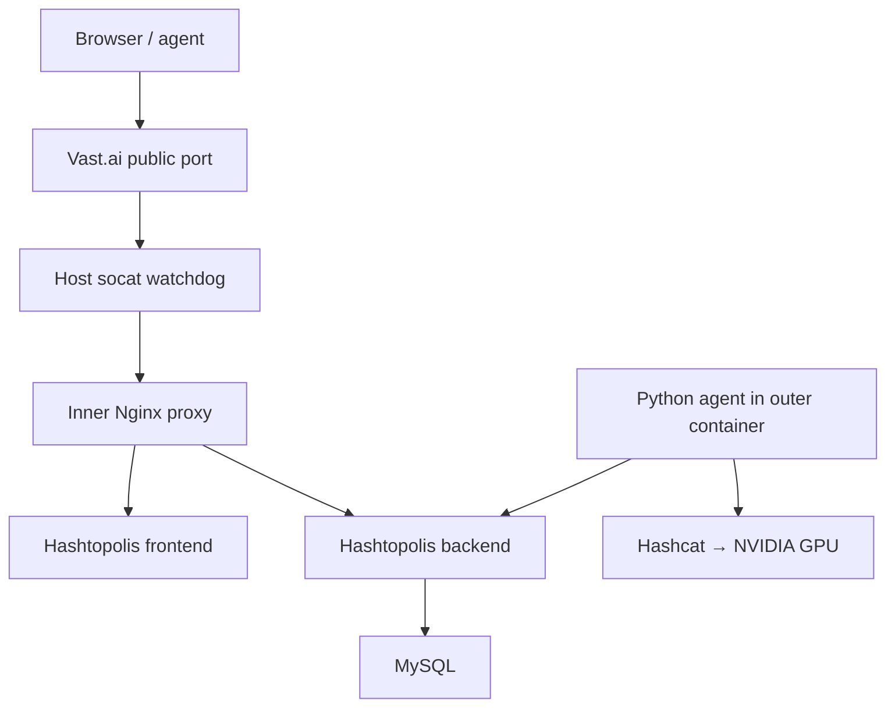

# KiQuai Hashtopolis + Hashcat trên Vast.ai

`run.sh` triển khai Hashtopolis bằng một Docker daemon riêng chạy bên trong CUDA container, còn Hashcat chạy trực tiếp trong CUDA container để sử dụng GPU do Vast.ai cấp.

> Chỉ sử dụng cho password recovery, security audit, phòng lab hoặc dữ liệu mà bạn có quyền xử lý.

## Kết luận quan trọng trước khi chạy

Vấn đề lớn nhất không nằm trong Bash script: tài liệu Vast.ai hiện tại cho biết trường **Docker Options** chỉ chấp nhận port, biến môi trường và hostname. Những cờ khác như `--privileged`, `--cap-add` hoặc `--shm-size` bị bỏ qua.

Điều này có các hệ quả trực tiếp:

- Ghi `--privileged` vào template không có nghĩa outer container thực sự được chạy privileged.
- Rootful Docker-in-Docker cần tối thiểu `CAP_SYS_ADMIN`, `CAP_NET_ADMIN`, quyền tạo namespace và quyền mount.
- Nếu Vast.ai loại bỏ các quyền này, không có tùy chọn `dockerd`, `iptables`, `overlay2`, `vfs` hoặc lệnh APT nào có thể tự cấp lại chúng.
- `run.sh` mới kiểm tra các quyền này trước khi cài package. Khi thiếu quyền, script dừng ngay với thông báo rõ ràng thay vì mất nhiều phút rồi báo `operation not permitted`.

Nguồn chính thức:

- [Vast.ai – Template Settings](https://docs.vast.ai/guides/templates/template-settings)
- [Vast.ai – Networking & Ports](https://docs.vast.ai/guides/instances/connect/networking)
- [Docker – Rootless mode](https://docs.docker.com/engine/security/rootless/)
- [Docker – Ubuntu 24.04 rootless troubleshooting](https://docs.docker.com/engine/security/rootless/troubleshoot/)

Quan điểm kỹ thuật: **không nên coi DinD trên một Vast.ai instance tiêu chuẩn là kiến trúc được bảo đảm hỗ trợ**. Chỉ tiếp tục nếu `./run.sh preflight` xác nhận capability thực sự tồn tại. Nếu preflight thất bại, phương án đúng là dùng VM/bare metal hỗ trợ nested containers, hoặc đóng gói Hashtopolis thành một outer image duy nhất không cần DinD.

## Kiến trúc thực tế



Các quyết định thiết kế:

- Hashtopolis frontend, backend, MySQL và Nginx chạy trong inner Docker Compose stack.
- Hashcat và Python agent chạy trực tiếp trong outer CUDA container; inner containers không cần NVIDIA runtime.
- Inner dockerd dùng socket riêng, data root riêng và không can thiệp Docker daemon khác.
- Inner dockerd chạy với `--iptables=false`, `--ip-masq=false` và `--bridge=none` để tránh lỗi tạo chain `DOCKER` trong nested environment.
- Compose vẫn tạo một user-defined bridge cho giao tiếp nội bộ. Outer container truy cập trực tiếp IP tĩnh của proxy container.
- Một socat watchdog bind `0.0.0.0:8080`, tự khởi động lại socat nếu tiến trình con kết thúc.
- Docker không publish port bên trong; port public duy nhất do Vast.ai map vào outer container.

Docker cảnh báo rằng tắt iptables có thể làm hỏng NAT/egress của bridge containers. Đây là chủ ý trong kiến trúc này: các service Hashtopolis chỉ cần giao tiếp nội bộ; image pull và Hashcat/agent chạy từ outer namespace. Xem [Docker packet filtering documentation](https://docs.docker.com/engine/network/packet-filtering-firewalls/).

## Những phần đã được sửa và tối ưu

Phiên bản `2.0.0` xử lý các lỗi quan trọng trong script cũ:

- Preflight kiểm tra GPU, capability, tmpfs mount và network namespace trước APT.
- Sửa lỗi rerun: socat do chính KiQuai tạo không còn bị nhận nhầm là “port 8080 đã bị chiếm”.
- Tự nhận diện và chuyển tiếp từ PID file socat của script cũ sang watchdog mới.
- Không còn dừng dockerd khỏe mạnh ở mỗi lần chạy; daemon hiện có được tái sử dụng.
- Bỏ tiến trình `containerd` thừa; dockerd tự quản lý containerd của nó.
- Không còn `pkill -f` rộng có nguy cơ giết nhầm tiến trình.
- Có deployment lock để ngăn hai lần chạy đồng thời làm hỏng state.
- `EXIT` trap luôn tạo diagnostics khi thất bại, kể cả lỗi phát sinh từ hàm `die`.
- Log có level, màu, số bước, thời gian từng bước, command/line gây lỗi và file báo cáo riêng.
- Retry có giới hạn cho APT, Docker repository và image pull.
- Tự chọn subnet không trùng route hiện tại; subnet đã lưu được tái sử dụng khi rerun.
- Storage driver `auto`: dùng `vfs` khi data root nằm trên outer `overlayfs`; dùng `overlay2` trên filesystem phù hợp.
- Không tự đổi storage driver nếu data root đã có dữ liệu, tránh làm volume “biến mất”.
- Credential cũ được giữ lại; biến truyền trực tiếp khi chạy luôn có ưu tiên cao hơn `.env`.
- Backend và frontend mặc định cùng tag `v1.0.0-rc1`, không còn trộn backend RC với frontend `master`.
- Healthcheck riêng cho DB, backend, frontend và proxy; trạng thái được in định kỳ khi chờ.
- Nginx không buffer toàn bộ upload lớn trước khi gửi backend; PHP upload/post limit được nâng đồng bộ lên `20G`.
- Docker JSON logs có giới hạn kích thước và số file.
- `WIPE_DATA=1` có guard đường dẫn và chỉ xóa đúng app/volume của stack.

## 1. Cấu hình Vast.ai

### Image

```text
nvidia/cuda:12.9.1-devel-ubuntu24.04
```

### Launch mode

Chọn **SSH**. Không nên chọn Jupyter nếu Jupyter cũng dùng port `8080`.

### Docker Options hợp lệ theo tài liệu Vast.ai

```bash
-p 8080:8080 -e OPEN_BUTTON_PORT=8080
```

Giải thích:

- `-p 8080:8080`: yêu cầu Vast.ai map một public TCP port vào port `8080` trong outer container.
- `OPEN_BUTTON_PORT=8080`: nút Open sử dụng external port tương ứng với internal port `8080`.
- External port thường là một số ngẫu nhiên. Vast.ai cung cấp nó qua `VAST_TCP_PORT_8080`.

Có thể giữ chuỗi cũ sau trong template, nhưng theo tài liệu hiện tại `--privileged` và `--shm-size=8g` sẽ bị bỏ qua:

```bash
--privileged -p 8080:8080 -e OPEN_BUTTON_PORT=8080 --shm-size=8g
```

## 2. Download và chạy preflight

Download script:

```bash
apt-get update && apt-get install -y curl ca-certificates
curl -fsSL https://raw.githubusercontent.com/kuronoFS/KiQuai/refs/heads/main/TestDiD/run.sh -o run.sh
chmod 700 run.sh
```

Chạy preflight trước:

```bash
./run.sh preflight
```

Kết quả đạt yêu cầu phải có ít nhất:

```text
CAP_SYS_ADMIN=present, CAP_NET_ADMIN=present
Mount namespace probe passed.
Network namespace probe passed.
Preflight passed.
```

Nếu thấy `ROOTFUL DOCKER-IN-DOCKER IS NOT AVAILABLE`, dừng tại đây. Rerun với `sudo`, cài thêm Docker hoặc đổi storage driver sẽ không giải quyết capability bị provider loại bỏ.

## 3. One-liner triển khai

Chỉ chạy sau khi preflight đã thành công:

```bash
bash -lc "apt-get update && apt-get install -y curl ca-certificates && curl -fsSL https://raw.githubusercontent.com/kuronoFS/KiQuai/refs/heads/main/TestDiD/run.sh -o /root/run.sh && chmod 700 /root/run.sh && /root/run.sh"
```

Nếu đã upload `run.sh` thủ công:

```bash
chmod 700 run.sh
./run.sh
```

Deployment mặc định gồm 11 giai đoạn. Mọi output được ghi đồng thời vào:

```text
/var/log/kiquai-hashtopolis/bootstrap.log
```

## 4. Kết quả sau khi thành công

Script in ra:

```text
Hashtopolis URL : http://PUBLIC_IP:EXTERNAL_PORT
Admin username  : admin
Admin password  : RANDOM_PASSWORD
API v2          : http://PUBLIC_IP:EXTERNAL_PORT/api/v2
Legacy agent API: http://PUBLIC_IP:EXTERNAL_PORT/api/server.php
```

Credential được lưu tại:

```text
/opt/kiquai-hashtopolis/.env
```

File có permission `600`. Không đăng file này vào Git hoặc gửi cùng diagnostic log.

## 5. Biến môi trường

| Biến | Mặc định | Mục đích |
|---|---:|---|
| `APP_DIR` | `/opt/kiquai-hashtopolis` | Compose, Nginx, credential và helper scripts |
| `INTERNAL_PORT` | `8080` | Port socat bind trong outer container |
| `PUBLIC_URL` | tự nhận diện | URL được frontend và script hiển thị |
| `DOCKER_SOCK` | `/var/run/kiquai-docker.sock` | Socket của inner dockerd |
| `DOCKER_DATA_ROOT` | `/var/lib/kiquai-docker` | Images, containers và named volumes |
| `DOCKER_STORAGE_DRIVER` | `auto` | `auto`, `overlay2` hoặc `vfs` |
| `COMPOSE_SUBNET` | `auto` | Subnet riêng của stack; giá trị đã lưu được giữ lại |
| `PROXY_STATIC_IP` | `auto` | IP tĩnh của inner Nginx proxy |
| `PULL_IMAGES` | `missing` | `always`, `missing` hoặc `never` |
| `FORCE_RECREATE` | `0` | Recreate container dù config/image không đổi |
| `WIPE_DATA` | `0` | Xóa database, file và credential của stack |
| `REQUIRE_HASHCAT_GPU` | `1` | Dừng nếu `hashcat -I` không phát hiện compute device |
| `SKIP_APT` | `0` | Bỏ APT; mọi dependency phải tồn tại sẵn |
| `DIAGNOSTICS_ON_FAILURE` | `1` | Tự sinh diagnostic report khi lỗi |
| `HASHTOPOLIS_BACKEND_IMAGE` | `hashtopolis/backend:v1.0.0-rc1` | Backend image |
| `HASHTOPOLIS_FRONTEND_IMAGE` | `hashtopolis/frontend:v1.0.0-rc1` | Frontend image cùng release channel |
| `DB_IMAGE` | `mysql:8.4` | Database image |
| `NGINX_IMAGE` | `nginx:1.27-alpine` | Reverse proxy image |

Ví dụ URL public không nhận diện đúng:

```bash
PUBLIC_URL="http://YOUR_PUBLIC_IP:YOUR_EXTERNAL_PORT" ./run.sh
```

Ví dụ dùng port khác:

```bash
INTERNAL_PORT=18080 ./run.sh
```

Template cũng phải map port tương ứng:

```bash
-p 18080:18080 -e OPEN_BUTTON_PORT=18080
```

## 6. Tối ưu storage trên Vast.ai

Nếu `/opt` nằm trên outer `overlayfs`, script chọn `vfs` để tránh nested-overlay và quota errors. `vfs` đáng tin cậy nhưng tốn dung lượng và chậm hơn vì không có copy-on-write.

Nếu instance có persistent/local volume tại `/data`, cấu hình khuyến nghị là:

```bash
APP_DIR=/data/kiquai-hashtopolis \
DOCKER_DATA_ROOT=/data/kiquai-docker \
./run.sh
```

`INTERNAL_PORT`, `DOCKER_SOCK`, `DOCKER_DATA_ROOT` và `DOCKER_EXEC_ROOT` được ghi vào `.env` và tự nạp lại. Riêng `APP_DIR` xác định vị trí của chính `.env`, vì vậy khi đã đổi `APP_DIR`, hãy tiếp tục truyền cùng giá trị cho các lệnh quản trị:

```bash
APP_DIR=/data/kiquai-hashtopolis ./run.sh status
APP_DIR=/data/kiquai-hashtopolis ./run.sh logs
```

Nếu `/data` là ext4 hoặc XFS hỗ trợ `d_type`, `auto` sẽ chọn `overlay2`. Xem:

- [Docker OverlayFS storage driver](https://docs.docker.com/engine/storage/drivers/overlayfs-driver/)
- [Docker VFS storage driver](https://docs.docker.com/engine/storage/drivers/vfs-driver/)
- [Docker data-root configuration](https://docs.docker.com/engine/daemon/)

Không đổi thủ công `overlay2` sang `vfs` trên một `DOCKER_DATA_ROOT` đã có dữ liệu. Mỗi driver nhìn thấy một layer store khác nhau. Script chủ động từ chối tình huống này.

## 7. Rerun, update và reset

Rerun an toàn, không xóa data:

```bash
./run.sh
```

Rerun và buộc recreate containers:

```bash
FORCE_RECREATE=1 ./run.sh
```

Hoặc:

```bash
./run.sh restart
```

Pull lại tất cả image tags rồi reconcile:

```bash
PULL_IMAGES=always FORCE_RECREATE=1 ./run.sh
```

Xóa hoàn toàn DB, file, volume và tạo credential mới:

```bash
WIPE_DATA=1 ./run.sh
```

`WIPE_DATA=1` là thao tác phá hủy dữ liệu. Script không tự bật tùy chọn này.

## 8. Kiểm tra và quản trị

Status tổng hợp:

```bash
./run.sh status
```

Log giới hạn theo service:

```bash
./run.sh logs
```

Tạo diagnostic report thủ công:

```bash
./run.sh diagnostics
```

Dừng stack nhưng giữ named volumes:

```bash
./run.sh stop
```

Nạp socket cho shell hiện tại:

```bash
source /etc/profile.d/kiquai-docker.sh
```

Lệnh Docker Compose trực tiếp:

```bash
cd /opt/kiquai-hashtopolis
docker compose ps -a
docker compose logs --tail 200 hashtopolis-db
docker compose logs --tail 200 hashtopolis-backend
docker compose logs --tail 200 hashtopolis-frontend
docker compose logs --tail 200 hashtopolis-proxy
```

HTTP local:

```bash
curl -fsS http://127.0.0.1:8080/healthz
curl -I http://127.0.0.1:8080/
curl -I http://127.0.0.1:8080/api/server.php
```

GPU và Hashcat:

```bash
nvidia-smi
hashcat -I
```

## 9. Log layout

| File | Nội dung |
|---|---|
| `/var/log/kiquai-hashtopolis/bootstrap.log` | Toàn bộ tiến trình deploy, stage và lỗi |
| `/var/log/kiquai-hashtopolis/dockerd.log` | Log inner Docker daemon |
| `/var/log/kiquai-hashtopolis/proxy.log` | Socat watchdog và restart events |
| `/var/log/kiquai-hashtopolis/hashcat-devices.log` | Output đầy đủ của `hashcat -I` |
| `/var/log/kiquai-hashtopolis/diagnostics/` | Báo cáo snapshot khi lỗi hoặc chạy `diagnostics` |

Diagnostic report gồm OS, capability, seccomp, cgroup, filesystem, route, listening ports, NVIDIA, Hashcat, Docker info, container state và bounded logs. Credential trong `.env` không được dump.

## 10. Troubleshooting

### `Missing capabilities required by rootful Docker-in-Docker`

Nguyên nhân: outer runtime không cấp `CAP_SYS_ADMIN` hoặc `CAP_NET_ADMIN`.

Kiểm tra:

```bash
./run.sh preflight
grep -E 'Cap(Eff|Bnd)|Seccomp' /proc/self/status
```

Đây là blocker ở tầng provider/runtime. Không sử dụng `ALLOW_UNPRIVILEGED_ATTEMPT=1` như một “fix”; biến này chỉ dành cho chẩn đoán runtime đặc biệt và dockerd vẫn có khả năng rất cao thất bại.

### `tmpfs mount is blocked` hoặc `Network namespace creation is blocked`

Outer container có thể hiển thị một phần capability nhưng seccomp/AppArmor vẫn chặn syscall cần thiết. DinD không thể hoạt động ổn định trong trạng thái này.

### `failed to mount overlay`, `operation not permitted`, `unable to setup quota`

Để script tự chọn driver:

```bash
DOCKER_STORAGE_DRIVER=auto ./run.sh
```

Ưu tiên đặt data root trên `/data` thay vì ép `overlay2` trên outer overlay filesystem:

```bash
DOCKER_DATA_ROOT=/data/kiquai-docker APP_DIR=/data/kiquai-hashtopolis ./run.sh
```

### `failed to create NAT chain DOCKER`

Bản mới không yêu cầu Docker tạo NAT chain:

```text
--iptables=false
--ip6tables=false
--ip-masq=false
--bridge=none
```

Nếu lỗi này vẫn xuất hiện, xác nhận shell đang dùng đúng socket:

```bash
echo "$DOCKER_HOST"
source /etc/profile.d/kiquai-docker.sh
docker info --format '{{.DockerRootDir}} {{.Driver}}'
```

Docker root đúng phải là `/var/lib/kiquai-docker` hoặc override mà bạn đã cấu hình.

### Port 8080 bị chiếm

```bash
ss -ltnp 'sport = :8080'
```

Script nhận diện được watchdog hiện tại và socat của phiên bản cũ. Nếu vẫn báo port bị chiếm, đó là process không thuộc KiQuai; dừng process đó hoặc đổi `INTERNAL_PORT` và port mapping của template.

### Frontend chạy nhưng API lỗi

```bash
./run.sh logs
curl -v http://127.0.0.1:8080/api/server.php
curl -v http://127.0.0.1:8080/api/v2
```

Kiểm tra backend/frontend đang dùng cùng release channel. Mặc định script pin cả hai ở `v1.0.0-rc1`.

Các tag hiện hành có thể kiểm tra tại:

- [Hashtopolis backend tags](https://hub.docker.com/r/hashtopolis/backend/tags)
- [Hashtopolis frontend tags](https://hub.docker.com/r/hashtopolis/frontend/tags)

### Public URL sai

```bash
echo "$PUBLIC_IPADDR"
echo "$VAST_TCP_PORT_8080"
```

Override khi cần:

```bash
PUBLIC_URL="http://PUBLIC_IP:EXTERNAL_PORT" ./run.sh
```

Vast.ai giải thích các biến `VAST_TCP_PORT_X` và `OPEN_BUTTON_PORT` tại [Networking & Ports](https://docs.vast.ai/guides/instances/connect/networking).

### `hashcat -I` không thấy RTX 5090

```bash
nvidia-smi
ls -l /dev/nvidia*
ldconfig -p | grep -E 'libcuda|libOpenCL'
clinfo | sed -n '1,160p'
hashcat -I
```

Ubuntu 24.04 cung cấp package Hashcat 6.2.6. Kiểm tra device thực tế bằng `hashcat -I`; script không suy luận khả năng tương thích chỉ từ việc `nvidia-smi` nhìn thấy GPU. Nguồn:

- [Ubuntu Noble hashcat package](https://packages.ubuntu.com/source/noble/hashcat)
- [Hashcat official site](https://hashcat.net/hashcat/)

## 11. Hashtopolis Python Agent

Script triển khai server và xác nhận Hashcat/GPU, nhưng không tự đăng ký agent vì voucher phải được tạo từ UI.

Quy trình:

1. Mở Hashtopolis UI.
2. Tạo agent và voucher.
3. Download Python agent.
4. Chạy agent trực tiếp trong outer CUDA container.
5. Cung cấp API URL:

```text
http://127.0.0.1:8080/api/server.php
```

Hoặc public URL nếu agent chạy trên máy khác:

```text
http://PUBLIC_IP:EXTERNAL_PORT/api/server.php
```

Hướng dẫn chính thức: [Hashtopolis basic installation – Agent installation](https://docs.hashtopolis.org/installation_guidelines/basic_install/).

## 12. Bảo mật và giới hạn vận hành

- Rootful DinD là kiến trúc có quyền cao. Chỉ sử dụng trên instance tách biệt, ngắn hạn và không chứa secret không liên quan.
- URL mặc định dùng HTTP. Không upload hash, wordlist hoặc credential nhạy cảm qua Internet công cộng nếu chưa có TLS/VPN/tunnel đáng tin cậy.
- Password ngẫu nhiên được lưu trong `.env`; bootstrap log cũng in password khi deploy thành công và có mode `600`.
- Dữ liệu trong container disk mất khi Vast.ai instance bị destroy, trừ khi `APP_DIR` và `DOCKER_DATA_ROOT` nằm trên volume bền vững như `/data`.
- Inner bridge containers không có outbound NAT khi iptables bị tắt. Đây là trade-off để tránh lỗi nested NAT; không dùng stack này cho service cần egress Internet tùy ý.
- `vfs` là fallback ổn định, không phải lựa chọn hiệu năng cao. Với workload lâu dài, dùng data root trên ext4/XFS và `overlay2`.

## 13. Tài liệu tham chiếu

- [Hashtopolis basic installation](https://docs.hashtopolis.org/installation_guidelines/basic_install/)
- [Hashtopolis official MySQL Compose file](https://github.com/hashtopolis/server/blob/master/docker-compose.mysql.yml)
- [Hashtopolis official environment example](https://github.com/hashtopolis/server/blob/master/env.mysql.example)
- [Docker dockerd reference](https://docs.docker.com/reference/cli/dockerd/)
- [Docker bridge networking](https://docs.docker.com/engine/network/drivers/bridge/)
- [Docker Engine installation on Ubuntu](https://docs.docker.com/engine/install/ubuntu/)
- [Vast.ai Docker execution environment](https://docs.vast.ai/guides/instances/docker-environment)
