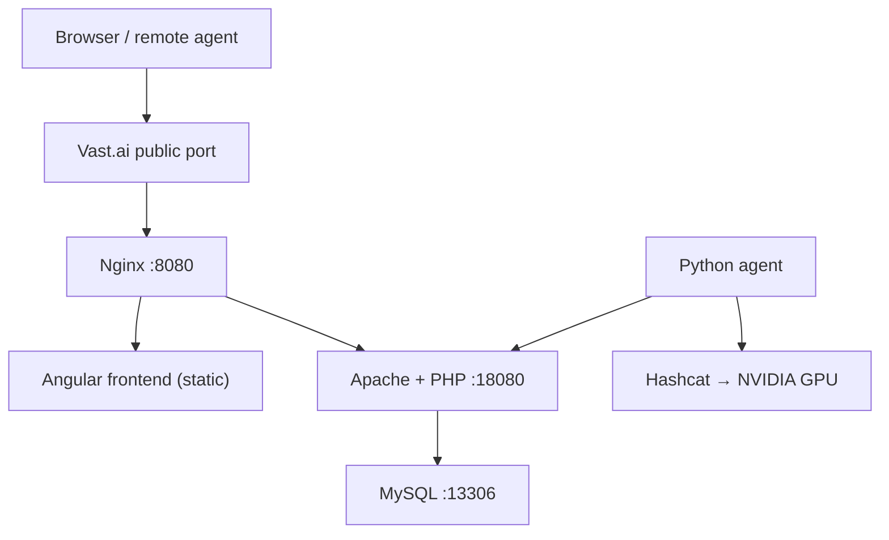
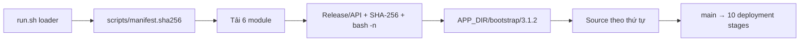

# KiQuai Hashtopolis + Hashcat trên Vast.ai

KiQuai triển khai toàn bộ stack trực tiếp trong **một CUDA container gốc của Vast.ai**. `run.sh` 3.1.2 chỉ là loader nhỏ: tải manifest và sáu module, kiểm tra từng file rồi mới nạp logic triển khai. Stack không cài Docker Engine, không khởi động `dockerd`, không dùng Docker Compose, không tạo nested container, bridge network hay `socat`.

Các process MySQL, Apache/PHP, Nginx và Hashtopolis Python Agent được quản lý bởi một `supervisord` riêng. Hashcat chạy trực tiếp trong cùng container để sử dụng GPU NVIDIA do Vast.ai gắn vào container đó.

> Chỉ sử dụng Hashtopolis và Hashcat cho hệ thống, dữ liệu và bài kiểm tra mà bạn được phép thực hiện.

## Kiến trúc



Tất cả node trong sơ đồ đều là process hoặc file nằm trong cùng outer container:

| Component | Bind mặc định | Public |
|---|---|---|
| Nginx + frontend | `0.0.0.0:8080` | Có, thông qua port mapping của Vast.ai |
| Apache/PHP backend | `127.0.0.1:18080` | Không; chỉ đi qua Nginx |
| MySQL | `127.0.0.1:13306` | Không |
| Python agent | Không mở port | Không |
| Hashcat | Không phải daemon | Không |

`supervisord` dùng socket riêng trong `APP_DIR/run/`; nó không thay thế supervisor hoặc entrypoint do image/Vast.ai cung cấp.

### Kiến trúc bootstrap module



Cấu trúc phải được commit cùng nhau trong `TestHash/`:

```text
TestHash/
├── run.sh
├── README.md
└── scripts/
    ├── manifest.sha256
    ├── 00-core.sh
    ├── 10-system.sh
    ├── 20-releases.sh
    ├── 30-config.sh
    ├── 40-services.sh
    └── 50-cli.sh
```

| Module | Trách nhiệm |
|---|---|
| `00-core.sh` | State, biến môi trường, validation, logging và error trap |
| `10-system.sh` | Preflight, APT, GPU/Hashcat, layout, legacy DinD cleanup và `sqlx` |
| `20-releases.sh` | Node.js, backend/frontend build và atomic symlink |
| `30-config.sh` | MySQL, PHP, Apache, Nginx, launcher và supervisor config |
| `40-services.sh` | MySQL provisioning, HTTP health check và Python agent |
| `50-cli.sh` | Diagnostics, command dispatch và 10 deployment stages |

Loader không source một module nếu thiếu file, sai checksum, sai module API/release hoặc không qua `bash -n`. Module đã xác minh được cache tại `APP_DIR/bootstrap/3.1.2/` để source từ một đường dẫn ổn định và để file/line trong diagnostic còn tra cứu được.

## Trạng thái hỗ trợ upstream

Hashtopolis chính thức khuyến nghị Docker từ phiên bản 0.14.0. Hướng dẫn cài trực tiếp không Docker vẫn tồn tại nhưng được upstream ghi rõ là **không được hỗ trợ chính thức**:

- [Hashtopolis basic installation](https://docs.hashtopolis.org/installation_guidelines/basic_install/)
- [Hashtopolis install without Docker](https://github.com/hashtopolis/server/wiki/Install-without-Docker)

Script này cố ý sử dụng phương thức native để tránh DinD trong môi trường Vast.ai. Nó bám theo dependency và startup flow trong Dockerfile/entrypoint chính thức: PHP extensions, Composer, `sqlx` migration CLI, thư mục dữ liệu, `setup.php`, frontend build và runtime config.

Phiên bản mặc định:

| Component | Phiên bản |
|---|---|
| Bootstrap/module release | `3.1.2` |
| Hashtopolis backend | `v1.0.0-rc2` |
| Hashtopolis frontend | `v1.0.0-rc2` |
| Python agent | Bản do backend cung cấp tại `agents.php?download=1` |
| Node.js | Đọc chính xác từ `.nvmrc` của frontend tag |
| PHP, MySQL, Nginx, Apache, Hashcat | Package của Ubuntu 24.04 |

Backend và frontend phải dùng tag tương thích. `v1.0.0-rc2` của cả hai repo được phát hành ngày 24/06/2026:

- [Backend tags](https://github.com/hashtopolis/server/tags)
- [Frontend tags](https://github.com/hashtopolis/web-ui/tags)

## 1. Cấu hình template Vast.ai

### Image

```text
nvidia/cuda:12.9.1-devel-ubuntu24.04
```

Script hiện hỗ trợ host `x86_64`.

### Launch mode

Chọn **SSH**. Jupyter thường sử dụng port nội bộ `8080` và có thể xung đột với Nginx của stack.

### Docker Options

```bash
-p 8080:8080 -e OPEN_BUTTON_PORT=8080
```

Không thêm `--privileged`, `--cap-add`, `--shm-size` hoặc mount Docker socket. Kiến trúc mới không cần các quyền đó. Tài liệu Vast.ai hiện chỉ hỗ trợ port, biến môi trường và hostname trong trường Docker Options:

- [Vast.ai Docker execution environment](https://docs.vast.ai/guides/instances/docker-environment)
- [Vast.ai networking and ports](https://docs.vast.ai/guides/instances/connect/networking)

Vast.ai map port nội bộ sang external port ngẫu nhiên và cung cấp external port qua `VAST_TCP_PORT_8080`. Script kết hợp biến này với `PUBLIC_IPADDR` để tạo `PUBLIC_URL`.

Nếu dùng port khác:

```bash
-p 18000:18000 -e OPEN_BUTTON_PORT=18000
```

và chạy:

```bash
INTERNAL_PORT=18000 ./run.sh
```

## 2. Download và chạy

> Phải push `run.sh`, `README.md`, `scripts/manifest.sha256` và cả sáu module trong **cùng một commit** trước khi dùng URL GitHub. Nhánh `main` phải thực sự chứa trọn release 3.1.2.

Nếu image đã có `curl`, one-liner cho trường **On-start Script** là:

```bash
bash -lc 'curl -fsSL https://raw.githubusercontent.com/kuronoFS/KiQuai/refs/heads/main/TestHash/run.sh -o /root/run.sh && chmod 700 /root/run.sh && /root/run.sh'
```

Đây là bản rút gọn được khuyến nghị. `run.sh` tự tải và kiểm tra manifest cùng từng module; không cần đưa sáu lệnh `curl` vào one-liner.

Nếu image tối giản chưa có `curl`/CA certificate, dùng bản portable:

```bash
bash -lc 'apt-get update && apt-get install -y curl ca-certificates && curl -fsSL https://raw.githubusercontent.com/kuronoFS/KiQuai/refs/heads/main/TestHash/run.sh -o /root/run.sh && chmod 700 /root/run.sh && /root/run.sh'
```

Không dùng `curl ... | bash` ở đây: lưu `/root/run.sh` giúp dùng lại cùng entrypoint cho `status`, `logs`, `diagnostics` và các lần reconcile.

Kiểm tra riêng module mà chưa deploy:

```bash
/root/run.sh verify-modules
```

Kết quả thành công phải xác nhận đủ sáu module. Ví dụ:

```text
OK [module=20-releases.sh] Checksum, release metadata, and Bash syntax verified.
OK [module=run.sh] All 6 modules are verified and loadable.
```

Preflight:

```bash
/root/run.sh preflight
```

Preflight chỉ yêu cầu:

- chạy bằng `root`;
- host `x86_64`;
- GPU và `nvidia-smi` nhìn thấy từ outer container;
- đủ dung lượng build tạm thời.

Không còn kiểm tra `CAP_SYS_ADMIN`, `CAP_NET_ADMIN`, mount namespace hoặc network namespace vì không còn DinD.

Triển khai:

```bash
/root/run.sh
```

Nên dành tối thiểu 15 GB trống cho lần build đầu. Script hard-fail ở ngưỡng `MIN_FREE_GB=10` theo mặc định.

Nếu muốn các service tự reconcile khi Vast.ai restart container, đặt one-liner rút gọn vào trường **On-start Script** của template SSH.

### Cố định một revision

`refs/heads/main` là mutable. Để mọi lần chạy dùng đúng cùng bộ file, đặt `KIQUAI_REF` thành full commit SHA và dùng SHA đó trong URL tải loader:

```bash
bash -lc 'REF=YOUR_FULL_COMMIT_SHA; curl -fsSL "https://raw.githubusercontent.com/kuronoFS/KiQuai/$REF/TestHash/run.sh" -o /root/run.sh && chmod 700 /root/run.sh && KIQUAI_REF="$REF" /root/run.sh'
```

Nếu pin revision qua Vast template, nên đặt thêm `-e KIQUAI_REF=YOUR_FULL_COMMIT_SHA` để các lệnh sau cũng dùng cùng revision. GitHub ghi rõ URL theo branch có thể đổi theo commit mới, còn URL chứa commit ID giữ nguyên nội dung.

## 3. Mười giai đoạn triển khai

Trước giai đoạn 01/10, loader tải và xác minh toàn bộ module. Sau đó flow triển khai vẫn gồm đúng mười giai đoạn:

1. Kiểm tra root, dung lượng và GPU NVIDIA.
2. Cài Apache, PHP, MySQL, Nginx, supervisor, Hashcat và build dependencies.
3. Tạo layout persistent, tiếp nhận credential cũ nếu có và lưu cấu hình.
4. Chạy `hashcat -I` để xác nhận compute device.
5. Cài `sqlx` migration CLI giống backend image chính thức.
6. Checkout và build backend/frontend ở hai tag tương thích.
7. Sinh cấu hình MySQL, Apache, Nginx, supervisor và initialize MySQL khi cần.
8. Khởi động process, tạo database/user và chạy migration/setup của Hashtopolis.
9. Kiểm tra frontend/API rồi cài Python agent.
10. In trạng thái và credential.

Lần đầu có thể mất nhiều thời gian ở bước build `sqlx` và Angular frontend. Các lần chạy sau tái sử dụng tool và release đã build.

## 4. Kết quả

Sau khi thành công, script in URL và trạng thái vào log, sau đó ghi credential trực tiếp ra console của operator:

```text
Hashtopolis URL : http://PUBLIC_IP:EXTERNAL_PORT
Admin username  : admin
Admin password  : RANDOM_PASSWORD
API v2          : http://PUBLIC_IP:EXTERNAL_PORT/api/v2
Legacy agent API: http://PUBLIC_IP:EXTERNAL_PORT/api/server.php
```

Credential và runtime settings nằm tại:

```text
/opt/kiquai-hashtopolis/.env
```

File có mode `600`. Không commit, upload hoặc đính kèm file này vào diagnostic report.

Xem lại credential bất kỳ lúc nào:

```bash
/root/run.sh credentials
```

Output của lệnh `credentials` đi qua console descriptor riêng và không được sao chép vào `loader.log` hoặc `bootstrap.log`. Nếu đang dùng release cũ chưa có command này:

```bash
set -a
source /opt/kiquai-hashtopolis/.env
set +a
printf 'URL: %s\nUser: %s\nPassword: %s\n' \
  "$PUBLIC_URL" "$HASHTOPOLIS_ADMIN_USER" "$HASHTOPOLIS_ADMIN_PASSWORD"
```

Data persistent:

```text
/opt/kiquai-hashtopolis/data/mysql
/opt/kiquai-hashtopolis/data/hashtopolis
/opt/kiquai-hashtopolis/agent
```

Source/build:

```text
/opt/kiquai-hashtopolis/releases
/opt/kiquai-hashtopolis/current
/opt/kiquai-hashtopolis/tools
```

## 5. Đăng ký GPU agent trong cùng container

Agent package được cài sẵn nhưng mặc định không chạy vì Hashtopolis cần voucher một lần.

1. Mở UI.
2. Vào **Agents → New Agent**.
3. Tạo voucher.
4. Chạy:

```bash
/root/run.sh agent-start YOUR_VOUCHER
```

Hoặc truyền voucher ngay lần deploy đầu:

```bash
AGENT_VOUCHER=YOUR_VOUCHER /root/run.sh
```

Agent kết nối qua loopback:

```text
http://127.0.0.1:8080/api/server.php
```

Sau khi agent tạo thành công `agent/config.json`, script xóa one-time voucher khỏi `.env`. Token/UUID đăng ký nằm trong `agent/config.json`.

Dừng agent nhưng giữ đăng ký:

```bash
/root/run.sh agent-stop
```

Khởi động lại agent đã đăng ký:

```bash
/root/run.sh agent-start
```

CLI options `--voucher` và `--url` được agent chính thức hỗ trợ; xem [Hashtopolis Python Agent](https://github.com/hashtopolis/agent-python).

Hashtopolis có thể yêu cầu agent tải một Hashcat package riêng cho task. `hashcat -I` trong bootstrap là preflight GPU; nó không ép server phải chọn đúng package Hashcat hệ thống cho mọi task.

## 6. Biến môi trường

### Module loader

| Biến | Mặc định | Mục đích |
|---|---|---|
| `KIQUAI_REPOSITORY` | `kuronoFS/KiQuai` | Repository chứa `TestHash/` |
| `KIQUAI_REF` | `refs/heads/main` | Branch, tag hoặc full commit SHA dùng cho manifest và module |
| `KIQUAI_BASE_URL` | Raw GitHub URL suy ra từ repo/ref | Override nguồn tải; hỗ trợ HTTPS và `file://` để kiểm thử |
| `KIQUAI_MODULE_DIR` | `APP_DIR/bootstrap/3.1.2` | Cache chỉ chứa module đã xác minh |
| `KIQUAI_LOADER_LOG` | `LOG_DIR/loader.log` | Log tải, checksum, syntax check và source module |

Loader yêu cầu `run.sh`, manifest và module có cùng release `3.1.2` và module API `1`. Không trộn file từ hai commit hoặc tự sửa module mà quên cập nhật manifest.

### Runtime và version

| Biến | Mặc định | Mục đích |
|---|---:|---|
| `APP_DIR` | `/opt/kiquai-hashtopolis` | Data, release, tool, agent và config |
| `LOG_DIR` | `/var/log/kiquai-hashtopolis` | Log bootstrap và service |
| `INTERNAL_PORT` | `8080` | Nginx public bind trong outer container |
| `BACKEND_PORT` | `18080` | Apache loopback |
| `DB_PORT` | `13306` | MySQL loopback |
| `PUBLIC_URL` | Tự nhận diện | URL trình duyệt và frontend API config |
| `HASHTOPOLIS_VERSION` | `v1.0.0-rc2` | Backend Git tag |
| `HASHTOPOLIS_FRONTEND_VERSION` | Cùng backend | Frontend Git tag |
| `HASHTOPOLIS_SERVER_REPOSITORY` | Repo chính thức | Backend Git URL |
| `HASHTOPOLIS_FRONTEND_REPOSITORY` | Repo chính thức | Frontend Git URL |

Nếu `APP_DIR` thay đổi, phải truyền cùng giá trị cho các lệnh sau vì `APP_DIR` quyết định vị trí của chính `.env`:

```bash
APP_DIR=/data/kiquai-hashtopolis /root/run.sh
APP_DIR=/data/kiquai-hashtopolis /root/run.sh status
APP_DIR=/data/kiquai-hashtopolis /root/run.sh logs
```

### Credential

| Biến | Mặc định |
|---|---|
| `MYSQL_ROOT_PASS` | Random 48 ký tự hex |
| `MYSQL_DATABASE` | `hashtopolis` |
| `MYSQL_USER` | `hashtopolis` |
| `MYSQL_PASSWORD` | Random 48 ký tự hex |
| `HASHTOPOLIS_ADMIN_USER` | `admin` |
| `HASHTOPOLIS_ADMIN_PASSWORD` | Random 48 ký tự hex |
| `HASHTOPOLIS_BACKEND_URL` | `PUBLIC_URL/api/v2` |
| `HASHTOPOLIS_FRONTEND_PORT` | Port được suy ra từ `PUBLIC_URL` |

Giá trị caller truyền trực tiếp có ưu tiên cao nhất; nếu không truyền, script tái sử dụng giá trị trong `.env`; nếu chưa có thì mới sinh mặc định.

### Agent và vận hành

| Biến | Mặc định | Mục đích |
|---|---:|---|
| `AGENT_ENABLED` | `0` | Tự chạy local agent |
| `AGENT_VOUCHER` | rỗng | Voucher đăng ký một lần |
| `AGENT_DOWNLOAD_URL` | Local `agents.php?download=1` | Override nguồn agent ZIP |
| `REQUIRE_HASHCAT_GPU` | `1` | Dừng nếu Hashcat không phát hiện device |
| `SKIP_APT` | `0` | Không chạy APT; dependency phải tồn tại |
| `FORCE_REBUILD` | `0` | Build lại release dù tag đã có |
| `KEEP_BUILD_TOOLCHAINS` | `0` | Giữ Rust cache và frontend `node_modules` |
| `MIN_FREE_GB` | `10` | Dung lượng trống tối thiểu |
| `DIAGNOSTICS_ON_FAILURE` | `1` | Tạo diagnostic report khi lỗi |
| `WIPE_DATA` | `0` | Xóa toàn bộ data/config của kiến trúc mới |

Server-only, không bắt buộc GPU Hashcat:

```bash
REQUIRE_HASHCAT_GPU=0 /root/run.sh
```

Rebuild đúng tag:

```bash
FORCE_REBUILD=1 /root/run.sh
```

Đổi version phải đổi cả backend và frontend sang cặp tương thích:

```bash
HASHTOPOLIS_VERSION=vX.Y.Z \
HASHTOPOLIS_FRONTEND_VERSION=vX.Y.Z \
FORCE_REBUILD=1 \
/root/run.sh
```

## 7. Quản trị

Status:

```bash
/root/run.sh status
```

Log:

```bash
/root/run.sh logs
```

Diagnostic:

```bash
/root/run.sh diagnostics
```

Credential quản trị, chỉ in ra console và không ghi vào log:

```bash
/root/run.sh credentials
```

Stop toàn bộ process được quản lý, giữ data:

```bash
/root/run.sh stop
```

Reconcile config và restart web services:

```bash
/root/run.sh restart
```

Rerun bình thường cũng idempotent:

```bash
/root/run.sh
```

Reset hoàn toàn kiến trúc mới:

```bash
WIPE_DATA=1 /root/run.sh
```

`WIPE_DATA=1` xóa database, Hashtopolis files, releases, agent registration và credential trong `APP_DIR`. Log mặc định ở `/var/log/kiquai-hashtopolis` được giữ.

## 8. Backup trước update/reset

Database:

```bash
set -a
source /opt/kiquai-hashtopolis/.env
set +a
MYSQL_PWD="$MYSQL_PASSWORD" mysqldump \
  --single-transaction \
  -h 127.0.0.1 -P "$DB_PORT" -u "$MYSQL_USER" \
  "$MYSQL_DATABASE" > /root/hashtopolis.sql
```

Files và agent state:

```bash
tar -C /opt/kiquai-hashtopolis \
  -czf /root/hashtopolis-files.tar.gz \
  data/hashtopolis agent
```

Không đưa các backup chứa hash, credential hoặc agent token lên nơi công khai.

## 9. Chuyển từ bản DinD cũ

Khi phát hiện `APP_DIR/docker-compose.yml`, script mới:

- chỉ dừng proxy/socat/dockerd cũ nếu PID file và command line đều xác nhận đó là process KiQuai;
- chuyển các file cấu hình DinD cũ vào `APP_DIR/legacy-dind-config/`;
- giữ lại credential chung từ `.env`;
- không gọi Docker CLI;
- không xóa `/var/lib/kiquai-docker`;
- không tự nhập Docker named volume cũ.

MySQL data trong inner Docker volume **không tương thích bằng cách copy thẳng thư mục**. Nếu instance cũ có dữ liệu quan trọng, hãy dump database và archive Hashtopolis volume từ bản cũ trước khi thay script, sau đó restore có kiểm soát vào bản mới. Cách an toàn nhất cho lần thử đầu là dùng một Vast.ai instance mới.

## 10. Log layout

| File | Nội dung |
|---|---|
| `loader.log` | Tải manifest/module, SHA-256, syntax check, source và output tiếp theo |
| `bootstrap.log` | Runtime config và mười deployment stages sau khi module đã nạp |
| `supervisord.log` | Process supervisor riêng |
| `mysql.log` | MySQL server |
| `backend.log` | Migration/setup và Apache launcher |
| `apache-error.log` | PHP/Apache errors |
| `nginx-error.log` | Nginx errors |
| `agent.log` | Python agent và Hashcat task output |
| `hashcat-devices.log` | Kết quả `hashcat -I` |
| `diagnostics/` | Snapshot chẩn đoán đã redact secret |

Mặc định:

```text
/var/log/kiquai-hashtopolis/
```

## 11. Troubleshooting

### Loader báo module lỗi

Chạy riêng verification:

```bash
/root/run.sh verify-modules
tail -n 250 /var/log/kiquai-hashtopolis/loader.log
```

Ý nghĩa lỗi:

| Thông báo | Nguyên nhân thường gặp |
|---|---|
| HTTP 404 khi tải manifest/module | Chưa push đủ cấu trúc `TestHash/scripts/` hoặc sai `KIQUAI_REF` |
| `Manifest release/module API does not match` | `run.sh` và module đến từ hai release/commit khác nhau |
| `SHA-256 mismatch` | Module đã thay đổi nhưng `manifest.sha256` chưa cập nhật, hoặc download bị thay đổi |
| `Bash syntax validation failed` | Module có lỗi parser; loader chưa source hay chạy nó |
| `Required function ... was not defined` | Module hợp lệ về cú pháp nhưng thiếu API function bắt buộc |

Lỗi loader in `Module`, `Source`, `Line`, `Function` và `Command`. Lỗi runtime còn in `Caller` khi command thất bại nằm trong một wrapper dùng chung. `bootstrap.log` và diagnostic report giữ cùng thông tin. Bash cung cấp `BASH_SOURCE`, `BASH_LINENO` và `FUNCNAME` để ánh xạ call stack về đúng file/hàm.

Khi chủ động sửa module, tạo lại manifest trước khi commit:

```bash
cd TestHash/scripts
{
  printf '%s\n' '# KiQuai verified module manifest' \
    '# kiquai-module-api: 1' \
    '# kiquai-release: 3.1.2'
  sha256sum 00-core.sh 10-system.sh 20-releases.sh \
    30-config.sh 40-services.sh 50-cli.sh
} > manifest.sha256
for file in ./*.sh ../run.sh; do bash -n "$file"; done
```

### Backend `BACKOFF` hoặc `spawn error` ở bước 08/10

Supervisor dùng trạng thái `BACKOFF` khi process thoát trước `startsecs`; lỗi thật nằm trong log của process, không phải trong chuỗi `spawn error`. Ở release 3.1.1, `sqlx-cli` chỉ được cache tại `APP_DIR/tools/bin/sqlx`, nhưng `setup.php` của Hashtopolis `v1.0.0-rc2` gọi trực tiếp `/usr/bin/sqlx`. Vì file đó không tồn tại, launcher backend thoát trước khi Apache khởi động. Frontend Angular tĩnh vẫn có thể mở qua Nginx trong trạng thái này, nhưng API chưa hoạt động.

Release 3.1.2 luôn publish binary đã kiểm tra tới `/usr/bin/sqlx`, kiểm tra quyền ghi lock directory trước migration và tự in `backend.log`/`apache-error.log` khi Supervisor không thể đưa backend lên `RUNNING`. Sau khi push trọn bộ 3.1.2, chỉ cần tải lại loader và chạy reconcile:

```bash
curl -fsSL https://raw.githubusercontent.com/kuronoFS/KiQuai/refs/heads/main/TestHash/run.sh -o /root/run.sh
chmod 700 /root/run.sh
/root/run.sh
```

Không dùng `WIPE_DATA=1` hoặc `FORCE_REBUILD=1`. Nếu cần sửa ngay instance đang chạy trước khi cập nhật repository:

```bash
install -m 755 /opt/kiquai-hashtopolis/tools/bin/sqlx /usr/bin/sqlx
supervisorctl -c /opt/kiquai-hashtopolis/config/supervisord.conf stop backend >/dev/null 2>&1 || true
supervisorctl -c /opt/kiquai-hashtopolis/config/supervisord.conf start backend
tail -n 220 /var/log/kiquai-hashtopolis/backend.log
```

Tham chiếu: [`setup.php` v1.0.0-rc2](https://github.com/hashtopolis/server/blob/v1.0.0-rc2/src/inc/startup/setup.php), [Dockerfile v1.0.0-rc2](https://github.com/hashtopolis/server/blob/v1.0.0-rc2/Dockerfile) và [Supervisor process states](https://supervisord.org/subprocess.html#process-states).

### Exit 7 tại `restart_web_services` ở bước 08/10

Lỗi này thuộc release 3.1.0 và đã sửa trong 3.1.1. `supervisorctl restart backend` thực hiện `stop` rồi `start`; khi backend chưa ở trạng thái `RUNNING`, phần `stop` trả mã 7 (`not running`) dù lần `start` sau đó có thể thành công. Vì thế web UI có thể truy cập trong khi bootstrap vẫn báo thất bại.

Logic này tiếp tục được giữ trong 3.1.2: script đọc trạng thái từng process, stop có kiểm soát, start khi cần và đợi `backend`/`nginx` đạt `RUNNING`. Cập nhật trọn bộ loader/module/manifest rồi chạy lại bình thường:

```bash
/root/run.sh
```

Không dùng `WIPE_DATA=1` và không cần `FORCE_REBUILD=1`; database cùng release hiện có sẽ được tái sử dụng.

### Cảnh báo Apache `Could not reliably determine the server's fully qualified domain name`

Đây chỉ là warning của `apache2ctl configtest`, không phải nguyên nhân exit 7. Từ release 3.1.1, script tạo global `ServerName 127.0.0.1` để loại bỏ cảnh báo này.

### `link: unbound variable` ở bước 06/10

Lỗi này thuộc bản monolith 3.0.0, được sửa trong 3.0.1 và bản sửa tiếp tục nằm trong module `20-releases.sh` của release 3.1.2. Hàm tạo symlink cũ từng khai báo `link` rồi tham chiếu `${link}` trong cùng một lệnh `local`; với `set -u`, Bash mở rộng tham số trước khi builtin `local` hoàn tất phép gán nên script dừng tại nhánh reuse backend.

Đảm bảo repository đã có trọn bộ 3.1.2, thay `/root/run.sh` bằng loader mới rồi chạy lại:

```bash
chmod +x /root/run.sh
/root/run.sh
```

Không cần xóa `APP_DIR` hay build lại backend. Release đã có marker `.kiquai-ready` sẽ được tái sử dụng và script tiếp tục build frontend. Nếu muốn ép build lại cả hai release, dùng `FORCE_REBUILD=1 /root/run.sh`.

### Port đã bị chiếm

```bash
ss -ltnp | grep -E ':(8080|18080|13306)\b'
```

Trong SSH mode, port `8080` thường trống. Nếu đang dùng Jupyter, đổi launch mode hoặc đổi `INTERNAL_PORT` và port mapping đồng thời.

### Build `sqlx` lâu

Lần đầu script cài Rust toolchain tối thiểu và compile `sqlx-cli` với MySQL support vì backend dùng SQLx migrations. Binary cuối được cache tại:

```text
APP_DIR/tools/bin/sqlx
```

Đồng thời script copy binary này tới `/usr/bin/sqlx`, là đường dẫn mà `setup.php` của backend `v1.0.0-rc2` gọi trực tiếp.

Rust cache được xóa sau build nếu `KEEP_BUILD_TOOLCHAINS=0`.

### Frontend build lỗi Node.js

Script không dùng Node.js cũ từ Ubuntu. Nó đọc version chính xác trong frontend `.nvmrc`, tải official Node tarball, kiểm tra SHA-256 rồi chạy `npm ci && npm run build`.

Kiểm tra:

```bash
find /opt/kiquai-hashtopolis/tools -maxdepth 2 -name node -o -name npm
tail -n 200 /var/log/kiquai-hashtopolis/bootstrap.log
```

### Backend restart liên tục

```bash
/root/run.sh status
tail -n 200 /var/log/kiquai-hashtopolis/backend.log
tail -n 200 /var/log/kiquai-hashtopolis/apache-error.log
tail -n 200 /var/log/kiquai-hashtopolis/mysql.log
```

Backend launcher đợi MySQL, chạy `src/inc/startup/setup.php` dưới user `www-data`, rồi mới start Apache. Lỗi migration sẽ được giữ trong `backend.log`.

### Public URL hoặc CORS sai

```bash
PUBLIC_URL="http://YOUR_PUBLIC_IP:YOUR_EXTERNAL_PORT" /root/run.sh
```

`PUBLIC_URL` được ghi vào frontend `assets/config.json`. Sau khi sửa, script restart Nginx/backend.

### Agent không đăng ký

```bash
/root/run.sh status
tail -n 250 /var/log/kiquai-hashtopolis/agent.log
```

Voucher là one-time token. Nếu voucher đã dùng hoặc hết hạn, tạo voucher mới rồi chạy:

```bash
/root/run.sh agent-start NEW_VOUCHER
```

### `hashcat -I` không thấy GPU

```bash
nvidia-smi
hashcat -I
ldconfig -p | grep -i -E 'libcuda|libOpenCL'
```

`nvidia-smi` thành công chưa đảm bảo OpenCL/CUDA backend mà Hashcat sử dụng đã được nhận diện. Dùng `REQUIRE_HASHCAT_GPU=0` chỉ khi cố ý triển khai server-only.

## 12. Bảo mật

- Nginx public mặc định dùng HTTP; đặt sau HTTPS tunnel/reverse proxy hoặc VPN khi có dữ liệu nhạy cảm.
- MySQL và Apache chỉ bind loopback.
- `.env`, agent `config.json`, database backup và hashlist là dữ liệu nhạy cảm.
- Không đặt credential trong public Vast.ai template.
- SHA-256 manifest phát hiện file module không đồng bộ hoặc bị thay đổi sau khi manifest được tạo; nó không thay thế chữ ký phát hành vì manifest và module cùng nằm trong một repository.
- Với môi trường cần tái lập chính xác, pin `KIQUAI_REF` bằng full commit SHA thay vì theo `main`.
- Đổi admin password sau lần đăng nhập đầu.
- `v1.0.0-rc2` là pre-release; backup trước khi đổi tag hoặc chạy migration.

## 13. Tài liệu tham chiếu

- [Hashtopolis server](https://github.com/hashtopolis/server)
- [Hashtopolis web UI](https://github.com/hashtopolis/web-ui)
- [Hashtopolis Python agent](https://github.com/hashtopolis/agent-python)
- [Hashtopolis official documentation](https://docs.hashtopolis.org/)
- [Hashtopolis backend Dockerfile v1.0.0-rc2](https://github.com/hashtopolis/server/blob/v1.0.0-rc2/Dockerfile)
- [Hashtopolis backend entrypoint v1.0.0-rc2](https://github.com/hashtopolis/server/blob/v1.0.0-rc2/docker-entrypoint.sh)
- [Hashtopolis setup.php v1.0.0-rc2](https://github.com/hashtopolis/server/blob/v1.0.0-rc2/src/inc/startup/setup.php)
- [Hashtopolis frontend Dockerfile](https://github.com/hashtopolis/web-ui/blob/master/Dockerfile)
- [Vast.ai Docker environment](https://docs.vast.ai/guides/instances/docker-environment)
- [Vast.ai networking and ports](https://docs.vast.ai/guides/instances/connect/networking)
- [GNU Bash variables: BASH_SOURCE, BASH_LINENO và FUNCNAME](https://www.gnu.org/software/bash/manual/html_node/Bash-Variables.html)
- [GitHub permanent links to files](https://docs.github.com/en/repositories/working-with-files/using-files/getting-permanent-links-to-files)
- [Supervisor: running supervisorctl](https://supervisord.org/running.html#running-supervisorctl)
- [Supervisor process states](https://supervisord.org/subprocess.html#process-states)
- [Hashcat official site](https://hashcat.net/hashcat/)
