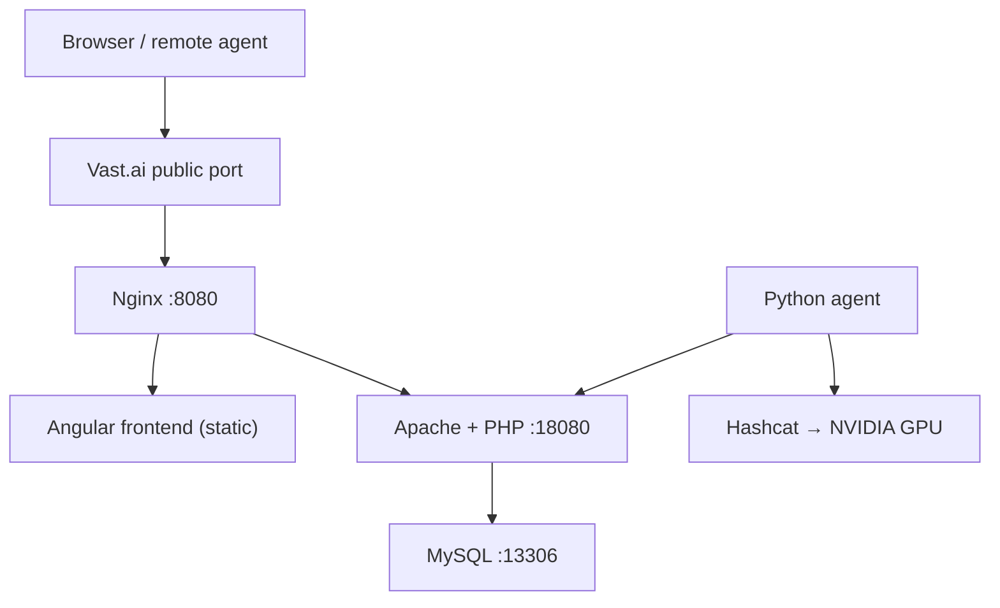
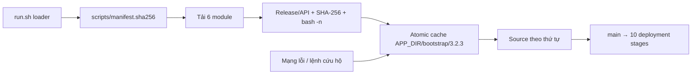

# KiQuai Hashtopolis + Hashcat trên Vast.ai

KiQuai triển khai toàn bộ stack trực tiếp trong **một CUDA container gốc của Vast.ai**. `run.sh` 3.2.3 chỉ là loader nhỏ: tải manifest và sáu module, kiểm tra từng file rồi mới nạp logic triển khai. Stack không cài Docker Engine, không khởi động `dockerd`, không dùng Docker Compose, không tạo nested container, bridge network hay `socat`.

Các process MySQL, Apache/PHP, Nginx và Hashtopolis Python Agent được quản lý bởi một `supervisord` riêng. Hashcat chạy trực tiếp trong cùng container để sử dụng GPU NVIDIA do Vast.ai gắn vào container đó.

> Chỉ sử dụng Hashtopolis và Hashcat cho hệ thống, dữ liệu và bài kiểm tra mà bạn được phép thực hiện.

## Kiến trúc



Tất cả node trong sơ đồ đều là process hoặc file nằm trong cùng outer container:

| Component | Bind mặc định | Public |
|---|---|---|
| Nginx + frontend | `0.0.0.0:8080` | Có, thông qua port mapping của Vast.ai |
| Apache/PHP backend | `127.0.0.1:18080` | Không; chỉ đi qua Nginx |
| MySQL | `127.0.0.1:13306` | Không |
| Python agent | Không mở port | Không |
| Hashcat | Không phải daemon | Không |

`supervisord` dùng socket riêng trong `APP_DIR/run/`. Lệnh `serve` giữ một foreground keeper theo dõi đúng PID Supervisor để workload/entrypoint không kết thúc; Supervisor vẫn dùng socket và PID file riêng, không giả mạo supervisor của Vast.ai.

### Kiến trúc bootstrap module



Cấu trúc phải được commit cùng nhau trong `TestHash/`:

```text
TestHash/
├── run.sh
├── README.md
├── tests/
│   └── test-shell.sh
└── scripts/
    ├── manifest.sha256
    ├── 00-core.sh
    ├── 10-system.sh
    ├── 20-releases.sh
    ├── 30-config.sh
    ├── 40-services.sh
    └── 50-cli.sh
```

| Module | Trách nhiệm |
|---|---|
| `00-core.sh` | State, biến môi trường, validation, logging và error trap |
| `10-system.sh` | Preflight, APT, GPU/Hashcat, layout, legacy DinD cleanup và `sqlx` |
| `20-releases.sh` | Node.js, immutable backend/frontend build và controlled activation |
| `30-config.sh` | MySQL, PHP, Apache, Nginx, runtime launcher và supervisor config |
| `40-services.sh` | MySQL provisioning, one-shot migration, HTTP contract check và Python agent |
| `50-cli.sh` | Diagnostics, command dispatch và 10 deployment stages |

Loader không source một module nếu thiếu file, sai checksum, sai module API/release hoặc không qua `bash -n`. Module đã xác minh được publish nguyên thư mục dưới lock tại `APP_DIR/bootstrap/3.2.3/`. Các lệnh vận hành như `status`, `logs`, `diagnostics`, `stop` và `help` ưu tiên cache đã xác minh nên vẫn dùng được khi GitHub tạm thời mất kết nối.

## Trạng thái hỗ trợ upstream

Hashtopolis chính thức khuyến nghị Docker từ phiên bản 0.14.0. Hướng dẫn cài trực tiếp không Docker vẫn tồn tại nhưng được upstream ghi rõ là **không được hỗ trợ chính thức**:

- [Hashtopolis basic installation](https://docs.hashtopolis.org/installation_guidelines/basic_install/)
- [Hashtopolis install without Docker](https://github.com/hashtopolis/server/wiki/Install-without-Docker)

Script này cố ý sử dụng phương thức native để tránh DinD trong môi trường Vast.ai. Nó bám theo dependency và startup flow trong Dockerfile/entrypoint chính thức: PHP extensions, Composer, `sqlx` migration CLI, thư mục dữ liệu, `setup.php`, frontend build và runtime config.

Phiên bản mặc định:

| Component | Phiên bản |
|---|---|
| Bootstrap/module release | `3.2.3` |
| Hashtopolis backend | `v1.0.0-rc2` |
| Hashtopolis frontend | `v1.0.0-rc2` |
| Python agent | Bản do backend cung cấp tại `agents.php?download=1` |
| Node.js | Đọc chính xác từ `.nvmrc` của frontend tag |
| PHP, MySQL, Nginx, Apache, Hashcat | Package của Ubuntu 24.04 |

Backend và frontend phải dùng tag tương thích. `v1.0.0-rc2` của cả hai repo được phát hành ngày 24/06/2026:

- [Backend tags](https://github.com/hashtopolis/server/tags)
- [Frontend tags](https://github.com/hashtopolis/web-ui/tags)

## 1. Cấu hình template Vast.ai

### Image

```text
nvidia/cuda:12.9.1-devel-ubuntu24.04
```

Script hiện hỗ trợ host `x86_64`.

### Launch mode

Chọn **SSH**. Jupyter thường sử dụng port nội bộ `8080` và có thể xung đột với Nginx của stack. Nếu chọn **Docker ENTRYPOINT** thay cho SSH, lệnh workload bắt buộc phải kết thúc bằng `exec /root/run.sh serve`; dùng `deploy` one-shot làm workload sẽ khiến PID chính thoát và outer container có thể bị nền tảng relaunch liên tục.

### Docker Options

```bash
-p 8080:8080 -e OPEN_BUTTON_PORT=8080
```

Không thêm `--privileged`, `--cap-add`, `--shm-size` hoặc mount Docker socket. Kiến trúc mới không cần các quyền đó. Tài liệu Vast.ai hiện chỉ hỗ trợ port, biến môi trường và hostname trong trường Docker Options:

- [Vast.ai Docker execution environment](https://docs.vast.ai/guides/instances/docker-environment)
- [Vast.ai networking and ports](https://docs.vast.ai/guides/instances/connect/networking)

Vast.ai map port nội bộ sang external port ngẫu nhiên và cung cấp external port qua `VAST_TCP_PORT_8080`. Script kết hợp biến này với `PUBLIC_IPADDR` để tạo `PUBLIC_URL`.

Nếu dùng port khác:

```bash
-p 18000:18000 -e OPEN_BUTTON_PORT=18000
```

và chạy:

```bash
INTERNAL_PORT=18000 ./run.sh deploy
```

## 2. Download và chạy

> Phải push `run.sh`, `README.md`, `scripts/manifest.sha256` và cả sáu module trong **cùng một commit** trước khi dùng URL GitHub. Nhánh `main` phải thực sự chứa trọn release 3.2.3.

Nếu image đã có `curl`, one-liner cho trường **On-start Script** là:

```bash
bash -lc 'curl -fsSL https://raw.githubusercontent.com/kuronoFS/KiQuai/refs/heads/main/TestHash/run.sh -o /root/run.sh && chmod 700 /root/run.sh && exec /root/run.sh serve'
```

Đây là bản rút gọn được khuyến nghị. `run.sh` tự tải và kiểm tra manifest cùng từng module; không cần đưa sáu lệnh `curl` vào one-liner. `serve` reconcile stack, giải phóng operation lock rồi theo dõi PID Supervisor ở foreground, nên các lệnh `status`, `logs`, `diagnostics` và `agent-start` vẫn chạy được từ terminal khác. Để tương thích one-liner cũ, gọi `run.sh` không tham số trong môi trường non-TTY cũng tự chọn `serve`; trong terminal tương tác nó chọn deploy one-shot.

Nếu image tối giản chưa có `curl`/CA certificate, dùng bản portable:

```bash
bash -lc 'apt-get update && apt-get install -y curl ca-certificates && curl -fsSL https://raw.githubusercontent.com/kuronoFS/KiQuai/refs/heads/main/TestHash/run.sh -o /root/run.sh && chmod 700 /root/run.sh && exec /root/run.sh serve'
```

Không dùng `curl ... | bash` ở đây: lưu `/root/run.sh` giúp dùng lại cùng entrypoint cho `status`, `logs`, `diagnostics` và các lần reconcile.

Kiểm tra riêng module mà chưa deploy:

```bash
/root/run.sh verify-modules
```

Kết quả thành công phải xác nhận đủ sáu module. Ví dụ:

```text
OK [module=20-releases.sh] Checksum, release metadata, and Bash syntax verified.
OK [module=run.sh] All 6 modules are verified and loadable.
```

Regression test không cần GPU/MySQL/service thật:

```bash
bash tests/test-shell.sh
```

Test kiểm tra `bash -n`, ShellCheck, manifest SHA-256, generated launcher/wrapper, registration token hợp lệ/stale/trùng/DB lỗi, URL normalization và identity backup/reset, credential redaction, semantic heartbeat/CPU-GPU health, stale/live agent lock, detached Hashcat cleanup, Supervisor state machine, policy task priority `0`, HTTP/migration contract, lifecycle `serve`, operation lock và cache loader khi offline.

Preflight:

```bash
/root/run.sh preflight
```

Preflight chỉ yêu cầu:

- chạy bằng `root`;
- host `x86_64`;
- GPU và `nvidia-smi` nhìn thấy từ outer container;
- đủ dung lượng build tạm thời.

Không còn kiểm tra `CAP_SYS_ADMIN`, `CAP_NET_ADMIN`, mount namespace hoặc network namespace vì không còn DinD.

Triển khai one-shot từ terminal SSH:

```bash
/root/run.sh deploy
```

Nên dành tối thiểu 15 GB trống cho lần build đầu. Script hard-fail ở ngưỡng `MIN_FREE_GB=10` theo mặc định.

Lệnh `deploy` trả về sau khi kiểm tra thành công. Với **On-start Script** hoặc Docker ENTRYPOINT/workload, luôn nên ghi rõ `serve`; lệnh này chỉ trả về khi container nhận TERM/INT hoặc Supervisor chết. TERM/INT được chuyển thành `supervisorctl shutdown`, còn HUP được bỏ qua để tránh đóng stack khi terminal tách phiên. Không tham số chỉ là cơ chế auto-detect tương thích ngược; automation one-shot nên luôn ghi rõ `deploy`.

### Cố định một revision

`refs/heads/main` là mutable. Để mọi lần chạy dùng đúng cùng bộ file, đặt `KIQUAI_REF` thành full commit SHA và dùng SHA đó trong URL tải loader:

```bash
bash -lc 'REF=YOUR_FULL_COMMIT_SHA; curl -fsSL "https://raw.githubusercontent.com/kuronoFS/KiQuai/$REF/TestHash/run.sh" -o /root/run.sh && chmod 700 /root/run.sh && export KIQUAI_REF="$REF" && exec /root/run.sh serve'
```

Nếu pin revision qua Vast template, nên đặt thêm `-e KIQUAI_REF=YOUR_FULL_COMMIT_SHA` để các lệnh sau cũng dùng cùng revision. GitHub ghi rõ URL theo branch có thể đổi theo commit mới, còn URL chứa commit ID giữ nguyên nội dung.

## 3. Mười giai đoạn triển khai

Trước giai đoạn 01/10, loader tải và xác minh toàn bộ module. Sau đó flow triển khai vẫn gồm đúng mười giai đoạn:

1. Kiểm tra root, dung lượng và GPU NVIDIA.
2. Cài Apache, PHP, MySQL, Nginx, supervisor, Hashcat và build dependencies.
3. Tạo layout persistent, tiếp nhận credential cũ nếu có và lưu cấu hình.
4. Chạy `hashcat -I` để xác nhận compute device.
5. Cài `sqlx` migration CLI giống backend image chính thức.
6. Checkout và build backend/frontend bất biến ở hai tag tương thích; chưa đổi release đang phục vụ.
7. Dừng agent/Nginx/backend, kích hoạt đồng bộ cặp release, sinh và kiểm tra cấu hình, rồi initialize MySQL khi cần.
8. Chỉ khởi động MySQL, tạo database/user, chặn migration dở, chạy `setup.php` đồng bộ đúng một lần, sau đó mới start backend/Nginx.
9. Kiểm tra frontend và JSON contract của legacy agent API rồi cài Python agent.
10. In trạng thái và vị trí lưu credential; không in mật khẩu tự động.

Lần đầu có thể mất nhiều thời gian ở bước build `sqlx` và Angular frontend. `sqlx-cli` được pin ở `0.9.0` và Rust ở `1.94.0`; các lần chạy sau chỉ tái sử dụng binary khi exact version khớp.

## 4. Kết quả

Sau khi thành công, `deploy`/`serve` chỉ in URL, trạng thái và lệnh lấy credential; mật khẩu không còn xuất hiện tự động trong container log:

```text
Hashtopolis URL : http://PUBLIC_IP:EXTERNAL_PORT
API v2          : http://PUBLIC_IP:EXTERNAL_PORT/api/v2
Legacy agent API: http://PUBLIC_IP:EXTERNAL_PORT/api/server.php
```

Credential và runtime settings nằm tại:

```text
/opt/kiquai-hashtopolis/.env
```

File có mode `600`. Không commit, upload hoặc đính kèm file này vào diagnostic report.

Xem lại credential bất kỳ lúc nào:

```bash
/root/run.sh credentials
```

Lệnh `credentials` chỉ chấp nhận một terminal tương tác. Output đi qua console descriptor riêng và không được sao chép vào `loader.log` hoặc `bootstrap.log`, nhưng terminal hoặc nền tảng vẫn có thể lưu console output; không redirect/pipe lệnh này vào file log. Nếu đang dùng release cũ chưa có command này:

```bash
set -a
source /opt/kiquai-hashtopolis/.env
set +a
printf 'URL: %s\nUser: %s\nPassword: %s\n' \
  "$PUBLIC_URL" "$HASHTOPOLIS_ADMIN_USER" "$HASHTOPOLIS_ADMIN_PASSWORD"
```

Data persistent:

```text
/opt/kiquai-hashtopolis/data/mysql
/opt/kiquai-hashtopolis/data/hashtopolis
/opt/kiquai-hashtopolis/agent
```

Source/build:

```text
/opt/kiquai-hashtopolis/releases
/opt/kiquai-hashtopolis/current
/opt/kiquai-hashtopolis/tools
```

## 5. Đăng ký GPU agent trong cùng container

Agent package được cài sẵn nhưng mặc định không chạy vì Hashtopolis cần voucher một lần.

1. Mở UI.
2. Vào **Agents → New Agent**.
3. Tạo voucher.
4. Chạy:

```bash
/root/run.sh agent-start YOUR_VOUCHER
```

Hoặc truyền voucher ngay lần deploy đầu:

```bash
AGENT_VOUCHER=YOUR_VOUCHER /root/run.sh deploy
```

Agent kết nối qua loopback:

```text
http://127.0.0.1:8080/api/server.php
```

Sau khi agent tạo token và token đó khớp đúng một hàng `Agent` trong database, script mới xóa one-time voucher khỏi `.env`. Token/UUID đăng ký nằm trong `agent/config.json` và không được in bởi `status`, `logs` hay `diagnostics`.

Dừng agent nhưng giữ đăng ký:

```bash
/root/run.sh agent-stop
```

Khởi động lại agent đã đăng ký:

```bash
/root/run.sh agent-start
```

Nếu truyền voucher mới trong khi token hiện tại vẫn hợp lệ, `agent-start` giữ nguyên agentId và assignment rồi bỏ qua voucher. Nếu token stale hoặc config hỏng, voucher rõ ràng cho phép script backup config mode `600`, xóa identity cũ và đăng ký lại; assignment của agentId cũ không được tự động chuyển sang agent mới.

CLI options `--voucher`, `--url` và `--disable-update` được agent chính thức hỗ trợ; KiQuai quản lý URL loopback và update archive qua compatibility wrapper. Xem [Hashtopolis Python Agent](https://github.com/hashtopolis/agent-python).

Wrapper 3.2.3 chỉ chấp nhận archive Python agent 0.7.4 đi kèm server RC2 có SHA-256 `7f6f00a9f1983e3d0f2db5f76f3bd8f0ffb20327ed77bb11659bb7740bff4da2`. `AGENT_DOWNLOAD_URL` tùy chỉnh phải trả đúng payload này; archive khác sẽ dừng với checksum rõ ràng thay vì chạy mà không được patch.

Hashtopolis có thể yêu cầu agent tải một Hashcat package riêng cho task. `hashcat -I` trong bootstrap là preflight GPU; nó không ép server phải chọn đúng package Hashcat hệ thống cho mọi task.

## 6. Biến môi trường

### Module loader

| Biến | Mặc định | Mục đích |
|---|---|---|
| `KIQUAI_REPOSITORY` | `kuronoFS/KiQuai` | Repository chứa `TestHash/` |
| `KIQUAI_REF` | `refs/heads/main` | Branch, tag hoặc full commit SHA dùng cho manifest và module |
| `KIQUAI_BASE_URL` | Raw GitHub URL suy ra từ repo/ref | Override nguồn tải; hỗ trợ HTTPS và `file://` để kiểm thử |
| `KIQUAI_MODULE_DIR` | `APP_DIR/bootstrap/3.2.3` | Cache chỉ chứa module đã xác minh |
| `KIQUAI_LOADER_LOG` | `LOG_DIR/loader.log` | Log tải, checksum, syntax check và source module |
| `KIQUAI_REFRESH_MODULES` | `0` | Đặt `1` để buộc lệnh vận hành thử refresh module thay vì ưu tiên cache |
| `KIQUAI_REQUIRE_FRESH_MODULES` | `0` | Đặt `1` để cấm fallback cache nếu tải mạng thất bại |

Loader yêu cầu `run.sh`, manifest và module có cùng release `3.2.3` và module API `1`. Không trộn file từ hai commit hoặc tự sửa module mà quên cập nhật manifest.

`deploy`/`restart` thử tải bộ module mới trước rồi fallback sang cache đã xác minh nếu lỗi mạng. `verify-modules` luôn yêu cầu tải thành công; các lệnh cứu hộ ưu tiên cache để không bị GitHub chặn việc debug hoặc stop service.

### Runtime và version

| Biến | Mặc định | Mục đích |
|---|---:|---|
| `APP_DIR` | `/opt/kiquai-hashtopolis` | Data, release, tool, agent và config |
| `LOG_DIR` | `/var/log/kiquai-hashtopolis` | Log bootstrap và service |
| `INTERNAL_PORT` | `8080` | Nginx public bind trong outer container |
| `BACKEND_PORT` | `18080` | Apache loopback |
| `DB_PORT` | `13306` | MySQL loopback |
| `PUBLIC_URL` | Tự nhận diện | URL trình duyệt và frontend API config |
| `HASHTOPOLIS_VERSION` | `v1.0.0-rc2` | Backend Git tag |
| `HASHTOPOLIS_FRONTEND_VERSION` | Cùng backend | Frontend Git tag |
| `HASHTOPOLIS_SERVER_REPOSITORY` | Repo chính thức | Backend Git URL |
| `HASHTOPOLIS_FRONTEND_REPOSITORY` | Repo chính thức | Frontend Git URL |

Nếu `APP_DIR` thay đổi, phải truyền cùng giá trị cho các lệnh sau vì `APP_DIR` quyết định vị trí của chính `.env`:

```bash
APP_DIR=/data/kiquai-hashtopolis /root/run.sh deploy
APP_DIR=/data/kiquai-hashtopolis /root/run.sh status
APP_DIR=/data/kiquai-hashtopolis /root/run.sh logs
```

### Credential

| Biến | Mặc định |
|---|---|
| `MYSQL_ROOT_PASS` | Random 48 ký tự hex |
| `MYSQL_DATABASE` | `hashtopolis` |
| `MYSQL_USER` | `hashtopolis` |
| `MYSQL_PASSWORD` | Random 48 ký tự hex |
| `HASHTOPOLIS_ADMIN_USER` | `admin` |
| `HASHTOPOLIS_ADMIN_PASSWORD` | Random 48 ký tự hex |
| `HASHTOPOLIS_BACKEND_URL` | `PUBLIC_URL/api/v2` |
| `HASHTOPOLIS_FRONTEND_PORT` | Port được suy ra từ `PUBLIC_URL` |

Giá trị caller truyền trực tiếp có ưu tiên cao nhất; nếu không truyền, script tái sử dụng giá trị trong `.env`; nếu chưa có thì mới sinh mặc định.

Riêng khi caller truyền `PUBLIC_URL` mới, script tự tính lại `HASHTOPOLIS_BACKEND_URL` và `HASHTOPOLIS_FRONTEND_PORT` nếu caller không override trực tiếp hai biến phụ này. Vì vậy frontend không còn giữ origin cũ từ `.env`.

### Agent và vận hành

| Biến | Mặc định | Mục đích |
|---|---:|---|
| `AGENT_ENABLED` | `0` | Tự chạy local agent |
| `AGENT_VOUCHER` | rỗng | Voucher đăng ký một lần |
| `AGENT_DOWNLOAD_URL` | Local `agents.php?download=1` | Override nguồn agent ZIP |
| `HASHTOPOLIS_AUTO_ASSIGN_PRIORITY_ZERO` | `1` | Cho phép agent tự nhận task priority `0` do WebUI tạo mặc định |
| `REQUIRE_HASHCAT_GPU` | `1` | Dừng nếu Hashcat không phát hiện device |
| `SKIP_APT` | `0` | Không chạy APT; dependency phải tồn tại |
| `FORCE_REBUILD` | `0` | Build lại release dù tag đã có |
| `KEEP_BUILD_TOOLCHAINS` | `0` | Giữ Rust cache và frontend `node_modules` |
| `MIN_FREE_GB` | `10` | Dung lượng trống tối thiểu |
| `DIAGNOSTICS_ON_FAILURE` | `1` | Tạo diagnostic report khi lỗi |
| `WIPE_DATA` | `0` | Xóa toàn bộ data/config của kiến trúc mới |

Server-only, không bắt buộc GPU Hashcat:

```bash
REQUIRE_HASHCAT_GPU=0 /root/run.sh deploy
```

Rebuild đúng tag:

```bash
FORCE_REBUILD=1 /root/run.sh deploy
```

Đổi version phải đổi cả backend và frontend sang cặp tương thích:

```bash
HASHTOPOLIS_VERSION=vX.Y.Z \
HASHTOPOLIS_FRONTEND_VERSION=vX.Y.Z \
FORCE_REBUILD=1 \
/root/run.sh deploy
```

## 7. Quản trị

Status:

```bash
/root/run.sh status
```

`status` chỉ trả exit `0` khi Supervisor programs bắt buộc, database login, GPU/Hashcat, frontend và JSON contract `testConnection` của agent API đều đạt. Khi `AGENT_ENABLED=1`, token còn phải khớp database, agent server-side phải Active, heartbeat không quá `agenttimeout` và GPU mode phải phù hợp. Trạng thái lỗi tự in bounded agent diagnostics đã redact; HTTP `404`/body sai hoặc migration `success=0` cũng trả exit khác `0`, phù hợp cho automation.

Log:

```bash
/root/run.sh logs
```

Diagnostic:

```bash
/root/run.sh diagnostics
```

Credential quản trị, chỉ cho phép từ terminal tương tác và không ghi vào log ứng dụng:

```bash
/root/run.sh credentials
```

Stop toàn bộ process được quản lý, giữ data:

```bash
/root/run.sh stop
```

Nếu `serve` đang chạy, foreground keeper vẫn sống sau lệnh `stop` để outer container không bị relaunch; chạy `restart` để bật lại stack. Muốn kết thúc cả keeper/container, dùng nút **Stop** của Vast.ai hoặc gửi TERM cho workload `serve`.

Reconcile config và restart web services:

```bash
/root/run.sh restart
```

Reconcile one-shot cũng idempotent:

```bash
/root/run.sh deploy
```

Reset hoàn toàn kiến trúc mới:

```bash
WIPE_DATA=1 /root/run.sh deploy
```

`WIPE_DATA=1` xóa database, Hashtopolis files, releases, agent registration và credential trong `APP_DIR`. Log mặc định ở `/var/log/kiquai-hashtopolis` được giữ.

## 8. Backup trước update/reset

Database:

```bash
set -a
source /opt/kiquai-hashtopolis/.env
set +a
MYSQL_PWD="$MYSQL_PASSWORD" mysqldump \
  --single-transaction \
  -h 127.0.0.1 -P "$DB_PORT" -u "$MYSQL_USER" \
  "$MYSQL_DATABASE" > /root/hashtopolis.sql
```

Files và agent state:

```bash
tar -C /opt/kiquai-hashtopolis \
  -czf /root/hashtopolis-files.tar.gz \
  data/hashtopolis agent
```

Không đưa các backup chứa hash, credential hoặc agent token lên nơi công khai.

## 9. Chuyển từ bản DinD cũ

Khi phát hiện `APP_DIR/docker-compose.yml`, script mới:

- chỉ dừng proxy/socat/dockerd cũ nếu PID file và command line đều xác nhận đó là process KiQuai;
- chuyển các file cấu hình DinD cũ vào `APP_DIR/legacy-dind-config/`;
- giữ lại credential chung từ `.env`;
- không gọi Docker CLI;
- không xóa `/var/lib/kiquai-docker`;
- không tự nhập Docker named volume cũ.

MySQL data trong inner Docker volume **không tương thích bằng cách copy thẳng thư mục**. Nếu instance cũ có dữ liệu quan trọng, hãy dump database và archive Hashtopolis volume từ bản cũ trước khi thay script, sau đó restore có kiểm soát vào bản mới. Cách an toàn nhất cho lần thử đầu là dùng một Vast.ai instance mới.

## 10. Log layout

| File | Nội dung |
|---|---|
| `loader.log` | Tải manifest/module, SHA-256, syntax check, source và output tiếp theo |
| `bootstrap.log` | Runtime config và mười deployment stages sau khi module đã nạp |
| `supervisord.log` | Process supervisor riêng |
| `mysql.log` | MySQL server |
| `migration.log` | `setup.php`/SQLx one-shot, có timestamp và `run_id` từng dòng |
| `backend.log` | Backend start gate và Apache launcher; không chạy migration |
| `apache-error.log` | PHP/Apache errors |
| `nginx-error.log` | Nginx errors |
| `agent.log` | Python agent và Hashcat task output |
| `APP_DIR/agent/client.log` | Log riêng của agent upstream; `logs`/`diagnostics` tail có redact token |
| `hashcat-devices.log` | Kết quả `hashcat -I` |
| `diagnostics/` | Snapshot chẩn đoán đã redact secret |

Mỗi lần gọi loader/runtime có `run_id` xuyên suốt `loader.log`, `bootstrap.log`, `migration.log` và launcher. `diagnostics` còn ghi trạng thái `_sqlx_migrations`, phiên bản SQLx và bounded tail của các log dịch vụ để phân biệt lỗi lịch sử với lỗi của lần chạy hiện tại.

Mặc định:

```text
/var/log/kiquai-hashtopolis/
```

## 11. Troubleshooting

### Loader báo module lỗi

Chạy riêng verification:

```bash
/root/run.sh verify-modules
tail -n 250 /var/log/kiquai-hashtopolis/loader.log
```

Ý nghĩa lỗi:

| Thông báo | Nguyên nhân thường gặp |
|---|---|
| HTTP 404 khi tải manifest/module | Chưa push đủ cấu trúc `TestHash/scripts/` hoặc sai `KIQUAI_REF` |
| `Manifest release/module API does not match` | `run.sh` và module đến từ hai release/commit khác nhau |
| `SHA-256 mismatch` | Module đã thay đổi nhưng `manifest.sha256` chưa cập nhật, hoặc download bị thay đổi |
| `Bash syntax validation failed` | Module có lỗi parser; loader chưa source hay chạy nó |
| `Required function ... was not defined` | Module hợp lệ về cú pháp nhưng thiếu API function bắt buộc |

Lỗi loader in `Module`, `Source`, `Line`, `Function` và `Command`. Lỗi runtime còn in `Caller` khi command thất bại nằm trong một wrapper dùng chung. `bootstrap.log` và diagnostic report giữ cùng thông tin. Bash cung cấp `BASH_SOURCE`, `BASH_LINENO` và `FUNCNAME` để ánh xạ call stack về đúng file/hàm.

Khi chủ động sửa module, tạo lại manifest trước khi commit:

```bash
cd TestHash/scripts
{
  printf '%s\n' '# KiQuai verified module manifest' \
    '# kiquai-module-api: 1' \
    '# kiquai-release: 3.2.3'
  sha256sum 00-core.sh 10-system.sh 20-releases.sh \
    30-config.sh 40-services.sh 50-cli.sh
} > manifest.sha256
for file in ./*.sh ../run.sh; do bash -n "$file"; done
```

### Banner CUDA/APT xuất hiện lặp lại sau `DEPLOYMENT COMPLETE`

Nếu `mysql`, `backend` và `nginx` đều `RUNNING`, HTTP contract đã pass, rồi log lập tức in lại banner `== CUDA ==` và chạy lại `apt-get`, đó là **outer container startup mới**, không phải Supervisor child crash. Nguyên nhân thường gặp là dùng `/root/run.sh deploy` hoặc `/root/run.sh` làm Docker workload/entrypoint: deploy trả exit `0`, PID chính kết thúc và nền tảng đưa instance mong muốn ở trạng thái running lên lại.

Release 3.2.3 tiếp tục dùng lifecycle foreground được giới thiệu ở 3.2.1:

```bash
exec /root/run.sh serve
```

`serve` deploy/reconcile xong sẽ giải phóng operation lock, log `keeper_pid`, `supervisor_pid`, PID 1 name và PID 1 start ticks, sau đó theo dõi Supervisor ở foreground. TERM/INT yêu cầu shutdown sạch; Supervisor biến mất ngoài ý muốn làm `serve` fail rõ ràng; `run.sh stop` được nhận diện là dừng có chủ ý và keeper tiếp tục sống. Trong template Vast.ai, dùng nguyên one-liner `... && exec /root/run.sh serve` ở phần trên.

Kiểm tra ranh giới outer container:

```bash
ps -p 1 -o pid,ppid,comm,args
awk '{print $22}' /proc/1/stat
tail -n 120 /var/log/kiquai-hashtopolis/bootstrap.log
```

### `migration ... is partially applied`

Đây là trạng thái database, không còn là lỗi thiếu binary. Log có thể chứa các dòng `/usr/bin/sqlx: not found` cũ vì log Supervisor được append; hãy xem `migration.log` và `run_id` mới nhất trước.

Release 3.1.2 từng để Supervisor tự start backend, trong khi backend launcher chạy `setup.php`. Sau khi provision database, chính flow deploy lại stop backend đang `STARTING`; nếu SQLx đang chạy, SIGTERM có thể để `_sqlx_migrations.success=0`. Release 3.2.0 loại bỏ race này: migration chạy đồng bộ ngoài Supervisor, backend/Nginx chỉ start sau khi setup thành công, và backend autorestart không bao giờ chạy migration lại.

Khi nâng cấp lần đầu, nếu launcher 3.1.x cũ vẫn đang chạy `setup.php`/`sqlx`, 3.2.0 chờ tối đa 900 giây thay vì gửi SIGTERM. Quá thời gian, cutover dừng fail-closed và giữ nguyên process để operator kiểm tra.

3.2.0 phát hiện row `success=0` trước khi đụng schema, in chính xác version/description/time rồi dừng với backend và Nginx ở trạng thái stopped. Script **không tự xóa row** vì MySQL DDL có thể đã commit một phần.

Kiểm tra:

```bash
set -a
source /opt/kiquai-hashtopolis/.env
set +a
MYSQL_PWD="$MYSQL_PASSWORD" mysql \
  -h 127.0.0.1 -P "$DB_PORT" -u "$MYSQL_USER" "$MYSQL_DATABASE" \
  -e 'SELECT version,description,installed_on,success FROM _sqlx_migrations ORDER BY version;'
tail -n 240 /var/log/kiquai-hashtopolis/migration.log
/root/run.sh diagnostics
```

Nếu instance chỉ là thử nghiệm và toàn bộ database/file/agent state có thể bỏ, cách sạch nhất là:

```bash
WIPE_DATA=1 /root/run.sh deploy
```

Nếu dữ liệu có giá trị, không chạy lệnh trên và không chỉ `DELETE` row migration. Hãy dừng service, sao lưu data directory/database, đối chiếu migration SQL đúng tag với schema đã áp dụng dở, rồi restore backup hoặc repair có kiểm soát trước khi chạy lại. Migration `20251127000000_initial.sql` dài và chứa nhiều DDL/seed data nên rerun mù sau khi xóa metadata có thể tạo duplicate hoặc constraint lỗi.

Tham chiếu: [`setup.php` v1.0.0-rc2](https://github.com/hashtopolis/server/blob/v1.0.0-rc2/src/inc/startup/setup.php), [`20251127000000_initial.sql`](https://github.com/hashtopolis/server/blob/v1.0.0-rc2/src/migrations/mysql/20251127000000_initial.sql), [Dockerfile v1.0.0-rc2](https://github.com/hashtopolis/server/blob/v1.0.0-rc2/Dockerfile) và [Supervisor process states](https://supervisord.org/subprocess.html#process-states).

### Backend `BACKOFF` hoặc `spawn error`

Từ 3.2.0, Supervisor chỉ quản lý Apache dài hạn; `setup.php` đã chạy xong trước đó. Vì vậy `BACKOFF` mới cần xem `backend.log`/`apache-error.log`, còn lỗi migration nằm riêng trong `migration.log`. Binary `/usr/bin/sqlx` luôn được publish và kiểm tra đúng `sqlx-cli 0.9.0` trước bước setup.

### Cảnh báo Apache `Could not reliably determine the server's fully qualified domain name`

Đây chỉ là warning của `apache2ctl configtest`, không phải nguyên nhân exit 7. Từ release 3.1.1, script tạo global `ServerName 127.0.0.1` để loại bỏ cảnh báo này.

### `link: unbound variable` ở bước 06/10

Lỗi này thuộc bản monolith 3.0.0, được sửa trong 3.0.1 và bản sửa tiếp tục nằm trong module `20-releases.sh` của release hiện tại. Hàm tạo symlink cũ từng khai báo `link` rồi tham chiếu `${link}` trong cùng một lệnh `local`; với `set -u`, Bash mở rộng tham số trước khi builtin `local` hoàn tất phép gán nên script dừng tại nhánh reuse backend.

Đảm bảo repository đã có trọn bộ 3.2.3, thay `/root/run.sh` bằng loader mới rồi chạy lại:

```bash
chmod +x /root/run.sh
/root/run.sh deploy
```

Không cần xóa `APP_DIR` hay build lại backend. Release đã có marker `.kiquai-ready` sẽ được tái sử dụng và script tiếp tục build frontend. Nếu muốn ép build lại cả hai release, dùng `FORCE_REBUILD=1 /root/run.sh deploy`.

### Port đã bị chiếm

```bash
ss -ltnp | grep -E ':(8080|18080|13306)\b'
```

Trong SSH mode, port `8080` thường trống. Nếu đang dùng Jupyter, đổi launch mode hoặc đổi `INTERNAL_PORT` và port mapping đồng thời.

### Build `sqlx` lâu

Lần đầu script cài Rust `1.94.0` và compile đúng `sqlx-cli 0.9.0` với MySQL support vì backend dùng SQLx migrations. Binary cache/system chỉ được reuse khi `sqlx --version` khớp chính xác:

```text
APP_DIR/tools/bin/sqlx
```

Đồng thời script copy binary này tới `/usr/bin/sqlx`, là đường dẫn mà `setup.php` của backend `v1.0.0-rc2` gọi trực tiếp.

Rust cache được xóa sau build nếu `KEEP_BUILD_TOOLCHAINS=0`.

### Frontend build lỗi Node.js

Script không dùng Node.js cũ từ Ubuntu. Nó đọc version chính xác trong frontend `.nvmrc`, tải official Node tarball, kiểm tra SHA-256 rồi chạy `npm ci && npm run build`.

Kiểm tra:

```bash
find /opt/kiquai-hashtopolis/tools -maxdepth 2 -name node -o -name npm
tail -n 200 /var/log/kiquai-hashtopolis/bootstrap.log
```

### Backend restart liên tục

```bash
/root/run.sh status
tail -n 200 /var/log/kiquai-hashtopolis/backend.log
tail -n 200 /var/log/kiquai-hashtopolis/apache-error.log
tail -n 200 /var/log/kiquai-hashtopolis/mysql.log
```

Backend launcher chỉ kiểm tra migration gate rồi start Apache; nó không gọi `setup.php`. Migration đồng bộ nằm trong `migration.log`. Nếu backend restart liên tục, trước hết xác nhận marker `APP_DIR/run/backend-ready` khớp release active và xem `apache-error.log`.

### Public URL hoặc CORS sai

```bash
PUBLIC_URL="http://YOUR_PUBLIC_IP:YOUR_EXTERNAL_PORT" /root/run.sh deploy
```

`PUBLIC_URL` được ghi vào frontend `assets/config.json`. Sau khi sửa, script restart Nginx/backend.

### Agent không đăng ký, không chạy hoặc không tự nhận task

```bash
/root/run.sh status
/root/run.sh logs
```

Voucher là one-time token. Nếu voucher đã dùng hoặc hết hạn, tạo voucher mới rồi chạy:

```bash
/root/run.sh agent-start NEW_VOUCHER
```

Agent upstream 0.7.4 để lại `agent/lock.pid` khi bị `SIGTERM` hoặc exception và có thể nhận nhầm PID Python/Jupyter đã tái sử dụng là một agent khác. Release 3.2.3 dùng `RUN_DIR/agent-runtime.lock` làm khóa chính, kiểm tra cả CWD lẫn đối số `hashtopolis.zip` trước khi dọn lock upstream, và dùng `SIGINT` để agent tự cleanup. Registration chỉ hoàn tất khi token trong `config.json` khớp đúng một agent trong database; voucher chỉ bị xóa sau khi kiểm tra này thành công. Launcher chuẩn hóa URL loopback và chạy archive 0.7.4 đã xác minh qua compatibility wrapper để nhận diện NVIDIA trong container, loại bỏ recursion ở registration/login, tải file atomically và quarantine cache cracker/preprocessor/Prince dở dang. Nếu start thất bại, lệnh in ngay trạng thái lock/process group, `agent.log` và `agent/client.log` đã redact trước khi dừng.

WebUI v1.0.0-rc2 tạo task mới với priority `0`, trong khi backend mặc định không tự gán priority `0`. KiQuai 3.2.3 đặt `priority0Start=1` khi deploy hoặc `agent-start`; đặt `HASHTOPOLIS_AUTO_ASSIGN_PRIORITY_ZERO=0` nếu muốn giữ hành vi upstream. Policy này chỉ chi phối lựa chọn task tự động; assignment thủ công vẫn cần agent đang chạy, **Active**, polling API và có quyền truy cập task/hashlist/file. Task tự động còn yêu cầu loại CPU/GPU khớp, chưa archived/hoàn tất và chưa chạm `Max agents`.

### `hashcat -I` không thấy GPU

```bash
nvidia-smi
hashcat -I
ldconfig -p | grep -i -E 'libcuda|libOpenCL'
```

`nvidia-smi` thành công chưa đảm bảo OpenCL/CUDA backend mà Hashcat sử dụng đã được nhận diện. Dùng `REQUIRE_HASHCAT_GPU=0` chỉ khi cố ý triển khai server-only.

## 12. Bảo mật

- Nginx public mặc định dùng HTTP; đặt sau HTTPS tunnel/reverse proxy hoặc VPN khi có dữ liệu nhạy cảm.
- MySQL và Apache chỉ bind loopback.
- `.env`, agent `config.json`, database backup và hashlist là dữ liệu nhạy cảm.
- Không đặt credential trong public Vast.ai template.
- SHA-256 manifest phát hiện file module không đồng bộ hoặc bị thay đổi sau khi manifest được tạo; nó không thay thế chữ ký phát hành vì manifest và module cùng nằm trong một repository.
- Với môi trường cần tái lập chính xác, pin `KIQUAI_REF` bằng full commit SHA thay vì theo `main`.
- Đổi admin password sau lần đăng nhập đầu.
- `v1.0.0-rc2` là pre-release; backup trước khi đổi tag hoặc chạy migration.

## 13. Tài liệu tham chiếu

- [Hashtopolis server](https://github.com/hashtopolis/server)
- [Hashtopolis web UI](https://github.com/hashtopolis/web-ui)
- [Hashtopolis Python agent](https://github.com/hashtopolis/agent-python)
- [Hashtopolis official documentation](https://docs.hashtopolis.org/)
- [Hashtopolis backend Dockerfile v1.0.0-rc2](https://github.com/hashtopolis/server/blob/v1.0.0-rc2/Dockerfile)
- [Hashtopolis backend entrypoint v1.0.0-rc2](https://github.com/hashtopolis/server/blob/v1.0.0-rc2/docker-entrypoint.sh)
- [Hashtopolis setup.php v1.0.0-rc2](https://github.com/hashtopolis/server/blob/v1.0.0-rc2/src/inc/startup/setup.php)
- [Hashtopolis frontend Dockerfile](https://github.com/hashtopolis/web-ui/blob/master/Dockerfile)
- [Vast.ai Docker environment](https://docs.vast.ai/guides/instances/docker-environment)
- [Vast.ai networking and ports](https://docs.vast.ai/guides/instances/connect/networking)
- [GNU Bash variables: BASH_SOURCE, BASH_LINENO và FUNCNAME](https://www.gnu.org/software/bash/manual/html_node/Bash-Variables.html)
- [GitHub permanent links to files](https://docs.github.com/en/repositories/working-with-files/using-files/getting-permanent-links-to-files)
- [Supervisor: running supervisorctl](https://supervisord.org/running.html#running-supervisorctl)
- [Supervisor process states](https://supervisord.org/subprocess.html#process-states)
- [Hashcat official site](https://hashcat.net/hashcat/)
